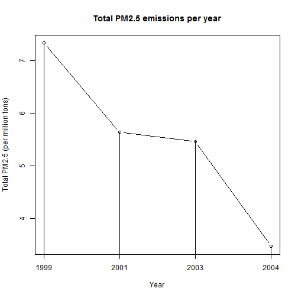
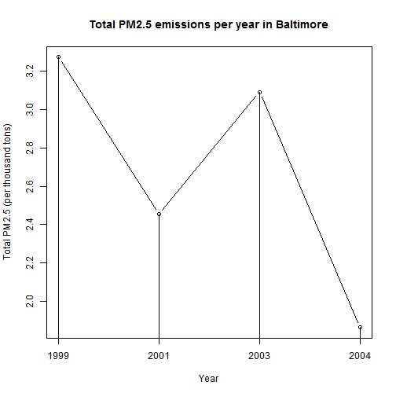
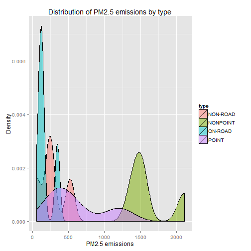
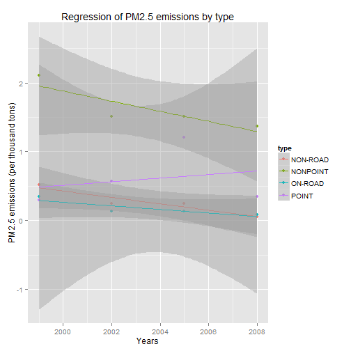
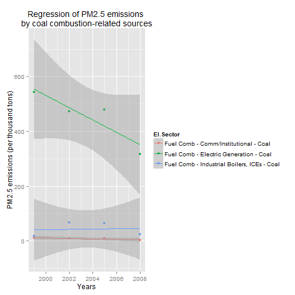
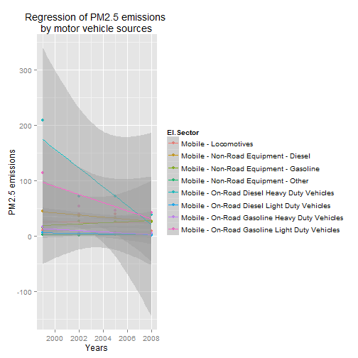
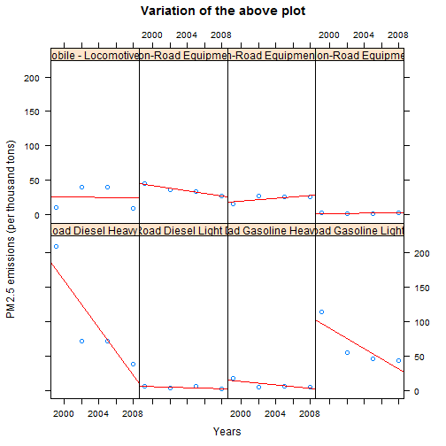
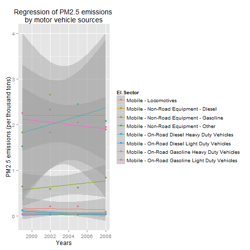
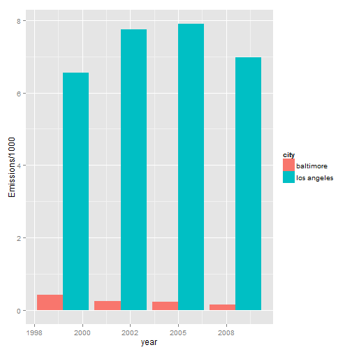
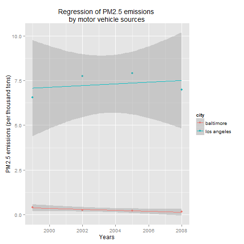

## Introduction
The overall goal of this assignment is to explore the National Emissions Inventory database and see what it says about fine particulate matter pollution in the United states over the 10-year period 1999-2008.

Fine particulate matter (PM2.5) is an ambient air pollutant for which there is strong evidence that it is harmful to human health. In the United States, the Environmental Protection Agency (EPA) is tasked with setting national ambient air quality standards for fine PM and for tracking the emissions of this pollutant into the atmosphere. Approximatly every 3 years, the EPA releases its database on emissions of PM2.5. This database is known as the National Emissions Inventory (NEI). You can read more information about the NEI at the EPA National Emissions Inventory web site.

For each year and for each type of PM source, the NEI records how many tons of PM2.5 were emitted from that source over the course of the entire year. The data that you will use for this assignment are for 1999, 2002, 2005, and 2008.

## Gathering and reading in of the data
Checks for the dataset and if it does not exist, downloads and extracts the files.

```r
NEI <- "summarySCC_PM25.rds"
SCC <- "Source_Classification_Code.rds"
if (!file.exists(NEI) | !file.exists(SCC)) {
    temp <- tempdir()
    url <- "http://d396qusza40orc.cloudfront.net/exdata%2Fdata%2FNEI_data.zip"
	file <- basename(url)
	download.file(url, file)
	unzip(file)
	unlink(temp)
}
print(dir())
```

```
## [1] "cache"                          "Emissions.html"                
## [3] "Emissions.md"                   "Emissions.Rmd"                 
## [5] "Emissions_cache"                "exdata%2Fdata%2FNEI_data.zip"  
## [7] "figure"                         "Source_Classification_Code.rds"
## [9] "summarySCC_PM25.rds"
```
Read the two files to dataframe.

```r
NEI <- readRDS(NEI)
print(str(NEI))
```

```
## 'data.frame':	6497651 obs. of  6 variables:
##  $ fips     : chr  "09001" "09001" "09001" "09001" ...
##  $ SCC      : chr  "10100401" "10100404" "10100501" "10200401" ...
##  $ Pollutant: chr  "PM25-PRI" "PM25-PRI" "PM25-PRI" "PM25-PRI" ...
##  $ Emissions: num  15.714 234.178 0.128 2.036 0.388 ...
##  $ type     : chr  "POINT" "POINT" "POINT" "POINT" ...
##  $ year     : int  1999 1999 1999 1999 1999 1999 1999 1999 1999 1999 ...
## NULL
```

```r
SCC <- readRDS(SCC)
print(str(SCC))
```

```
## 'data.frame':	11717 obs. of  15 variables:
##  $ SCC                : Factor w/ 11717 levels "10100101","10100102",..: 1 2 3 4 5 6 7 8 9 10 ...
##  $ Data.Category      : Factor w/ 6 levels "Biogenic","Event",..: 6 6 6 6 6 6 6 6 6 6 ...
##  $ Short.Name         : Factor w/ 11238 levels "","2,4-D Salts and Esters Prod /Process Vents, 2,4-D Recovery: Filtration",..: 3283 3284 3293 3291 3290 3294 3295 3296 3292 3289 ...
##  $ EI.Sector          : Factor w/ 59 levels "Agriculture - Crops & Livestock Dust",..: 18 18 18 18 18 18 18 18 18 18 ...
##  $ Option.Group       : Factor w/ 25 levels "","C/I Kerosene",..: 1 1 1 1 1 1 1 1 1 1 ...
##  $ Option.Set         : Factor w/ 18 levels "","A","B","B1A",..: 1 1 1 1 1 1 1 1 1 1 ...
##  $ SCC.Level.One      : Factor w/ 17 levels "Brick Kilns",..: 3 3 3 3 3 3 3 3 3 3 ...
##  $ SCC.Level.Two      : Factor w/ 146 levels "","Agricultural Chemicals Production",..: 32 32 32 32 32 32 32 32 32 32 ...
##  $ SCC.Level.Three    : Factor w/ 1061 levels "","100% Biosolids (e.g., sewage sludge, manure, mixtures of these matls)",..: 88 88 156 156 156 156 156 156 156 156 ...
##  $ SCC.Level.Four     : Factor w/ 6084 levels "","(NH4)2 SO4 Acid Bath System and Evaporator",..: 4455 5583 4466 4458 1341 5246 5584 5983 4461 776 ...
##  $ Map.To             : num  NA NA NA NA NA NA NA NA NA NA ...
##  $ Last.Inventory.Year: int  NA NA NA NA NA NA NA NA NA NA ...
##  $ Created_Date       : Factor w/ 57 levels "","1/27/2000 0:00:00",..: 1 1 1 1 1 1 1 1 1 1 ...
##  $ Revised_Date       : Factor w/ 44 levels "","1/27/2000 0:00:00",..: 1 1 1 1 1 1 1 1 1 1 ...
##  $ Usage.Notes        : Factor w/ 21 levels ""," ","includes bleaching towers, washer hoods, filtrate tanks, vacuum pump exhausts",..: 1 1 1 1 1 1 1 1 1 1 ...
## NULL
```

## Exploring the data


#### 1. Have total emissions from PM2.5 decreased in the United States from 1999 to 2008?
The sum PM2.5 emission values for each year are calculated and assigned to a new dataframe.

```r
totalPerYear <- aggregate(Emissions ~ year, NEI, sum)
```
A plot is made indicating the total PM2.5 values per year.

```r
plot(totalPerYear$year, totalPerYear$Emissions/1000000, type = "b", 
     xlab = "Year", ylab = "Total PM2.5 (per million tons)", 
     main = "Total PM2.5 emissions per year", xaxt='n')
lines(totalPerYear$year, totalPerYear$Emissions/1000000, type = "h")
axis(side=1, at=seq(1999, 2008, 3), labels = c("1999","2001","2003","2004"))
```

 

The US over a ten year period has reduced their PM2.5 emissions by nearly fifty percent and PM2.5 emissions would most likely continue to decline in the after years.

#### 2. Have total emissions from PM2.5 decreased in the Baltimore City, Maryland (fips == "24510") from 1999 to 2008?
The sum PM2.5 emission values for each year in Baltimore are calculated and assigned to a new dataframe.

```r
baltimoreNEI <- NEI[NEI$fips == "24510", ]
baltimoreTotal <- aggregate(Emissions ~ year, baltimoreNEI, sum)
```
A plot is made indicating the total PM2.5 values per year in Baltimore.

```r
plot(baltimoreTotal$year, baltimoreTotal$Emissions/1000, type = "b", 
     xlab = "Year", ylab = "Total PM2.5 (per thousand tons)", 
     main = "Total PM2.5 emissions per year in Baltimore", xaxt='n')
lines(baltimoreTotal$year, baltimoreTotal$Emissions/1000, type = "h")
axis(side=1, at=seq(1999, 2008, 3), labels = c("1999","2001","2003","2004"))
```

 

Baltimore over a ten year period has reduced its PM2.5 emissions by nearly a third although it is hard to predict if PM2.5 emissions will continue to decline in the after years.

#### 3. Of the four types of sources indicated by the type (point, nonpoint, onroad, nonroad) variable, which of these four sources have seen decreases in emissions from 1999-2008 for Baltimore City?
The sum PM2.5 emission values for each year and type in Baltimore are calculated and assigned to a new dataframe.

```r
baltimoreType <- aggregate(Emissions ~ year + type, baltimoreNEI, sum)
```
A plot is made showing distribution of PM2.5 emissions by Type in Baltimore.

```r
library(ggplot2)
qplot(Emissions, data=baltimoreType, geom="density", fill=type, alpha=I(.5),
      main="Distribution of PM2.5 emissions by type", xlab="PM2.5 emissions",
      ylab="Density")
```

 

A plot is made with regressions of PM2.5 emissions by Type per year in Baltimore.

```r
qplot(year, Emissions/1000, data=baltimoreType, geom=c("point", "smooth"),
      method="lm", formula=y~x, color=type,
      main="Regression of PM2.5 emissions by type",
      xlab="Years", ylab="PM2.5 emissions (per thousand tons)")
```

 

Over a ten year period in Baltimore nonpoint, onroad and nonroad sources of PM2.5 emissions have decreased. Whereas point sources have increased.

#### 4. Across the United States, how have emissions from coal combustion-related sources changed from 1999-2008?
The sum PM2.5 emission values for each year per coal combustion-related source are calculated and assigned to a new dataframe.

```r
index <- as.character(SCC$EI.Sector)
SCCCoal <- subset(SCC,grepl(".*Coal", index))
coalNEI <- merge(SCCCoal, NEI, by="SCC")
coalNEI <- aggregate(Emissions ~ year + EI.Sector, coalNEI, sum)
```
A plot is made with regressions of PM2.5 emissions per year by coal combustion-related source.

```r
qplot(year, Emissions/1000, data=coalNEI, geom=c("point", "smooth"),
      method="lm", formula=y~x, color=EI.Sector,
      main="Regression of PM2.5 emissions \nby coal combustion-related sources",
      xlab="Years", ylab="PM2.5 emissions (per thousand tons)")
```

 

Over a ten year period across the US, Comm/Institutional PM2.5 emissions reduced slighty whereas Industrial Boilers, ICEs emissions have increased slightly. Electric Generation emissions have seen the most dramatic reduction and will more than likely continue to reduce. Due to the dramatic decrease of Electric Generation emissions, coal combustion-related sources of emission are decreasing.

#### 5. How have emissions from motor vehicle sources changed from 1999-2008 in Baltimore City?
The sum PM2.5 emission values for each year per motor vehicle source are calculated and assigned to a new dataframe.

```r
index <- as.character(SCC$EI.Sector)
SCCMobile <- subset(SCC,grepl(".*Mobile", index))
SCCMobile <- SCCMobile[SCCMobile$EI.Sector != "Mobile - Aircraft", ]
SCCMobile <- SCCMobile[SCCMobile$EI.Sector != "Mobile - Commercial Marine Vessels", ]
mobileNEI <- merge(SCCMobile, baltimoreNEI, by="SCC")
mobileNEI <- aggregate(Emissions ~ year + EI.Sector, mobileNEI, sum)
```
A plot is made with regressions of PM2.5 emissions per year by motor vehicle source in Baltimore.

```r
qplot(year, Emissions, data=mobileNEI, geom=c("point", "smooth"),
      method="lm", formula=y~x, color=EI.Sector,
      main="Regression of PM2.5 emissions \nby motor vehicle sources",
      xlab="Years", ylab="PM2.5 emissions")
```

 

The overall emissions of motor vehicle sources are collectively decreasing in Baltimore.


```r
require("lattice")
xyplot(Emissions ~ year | EI.Sector, mobileNEI, layout = c(4, 2), 
       main = "Variation of the above plot", ylab = "PM2.5 emissions (per thousand tons)", 
       xlab = "Years", 
       panel = function(x, y) {
           panel.xyplot(x, y)
           panel.lmline(x, y, lty = 1, col = "red")
           par.strip.text = list(cex = 0.8)}, 
       as.table = T)
```

 

#### 6. Compare emissions from motor vehicle sources in Baltimore City with emissions from motor vehicle sources in Los Angeles County, California (fips == "06037"). Which city has seen greater changes over time in motor vehicle emissions?
The sum PM2.5 emission values for each year per motor vehicle source and city are calculated and assigned to a new dataframe.

```r
losAngelesNEI <- NEI[NEI$fips == "06037", ]
losAngelesNEI$city <- "los angeles"
baltimoreNEI$city <- "baltimore"
combinedNEI <- rbind(baltimoreNEI, losAngelesNEI)
combinedNEI <- merge(SCCMobile, combinedNEI, by="SCC")
combinedNEI <- aggregate(Emissions ~ year + EI.Sector + city, combinedNEI, sum)
```
A plot is made with regressions of PM2.5 emissions per year by motor vehicle source in Los Angeles.

```r
qplot(year, Emissions/1000, data=combinedNEI[combinedNEI$city == "los angeles", ], 
      geom=c("point", "smooth"),
      method="lm", formula=y~x, color=EI.Sector,
      main="Regression of PM2.5 emissions \nby motor vehicle sources",
      xlab="Years", ylab="PM2.5 emissions (per thousand tons)")
```

 

```r
g6 <- ggplot(aggregate(Emissions ~ year + city, combinedNEI, sum), 
             aes(x = year, y = Emissions/1000, fill = city))
g6 + geom_bar(stat = "identity", position = position_dodge())
```

 

```r
qplot(year, Emissions/1000, data=aggregate(Emissions ~ year + city, combinedNEI, sum), 
      geom=c("point", "smooth"),
      method="lm", formula=y~x, color=city,
      main="Regression of PM2.5 emissions \nby motor vehicle sources",
      xlab="Years", ylab="PM2.5 emissions (per thousand tons)")
```

 

Los Angeles produces a far higher volume of PM2.5 emissions from motor vehicle sources than Baltimore. Los Angeles has seen far greater changes over time in motor vehicle emissions due to the sheer volume it produces even though it has shown an increase of emissions over the years.

